----------------------------------------------------------------------------
### Learning canvas by next courses:
 - [CodingMath](https://www.youtube.com/channel/UCF6F8LdCSWlRwQm_hfA2bcQ)
 - [ChrisCourses](https://http://chriscourses.com/)
 - [ChrisCoursesGit](https://github.com/christopher4lis)

----------------------------------------------------------------------------
#### Terminology
 - **velocity**	- вектор скорости (быстрота, ускорение); _Velocity = distance / time_
 - **acceleration**	- acceleration is changing velocity!!! Величина на которую каждый фрейм будет увеличиваеться velocity; _#(Look Episode 9, 4:55);_
 - **gravity**	- гравитация _(Gravity is a type of acceleration)_
 - **friction** - сила трения -  - величина на которую будет уменьшаться значение с каждым разом, например при каждом касания мячом пола
 - **collision** - столкновение. Основана на Теореме Пифагора 

----------------------------------------------------------------------------
#### In most computer systems using radians instead of degrees.
 - 1rad = ~57.3deg --> 360deg = 6.28rad
 - Math.PI * 2 = 6.283185307179586rad = 360deg

----------------------------------------------------------------------------
#### Convert Radians to Degrees:
  *  degrees = (radians * 180) / Math.PI
  *  (6.283185307179586 * 180) / Math.PI; --> 360deg
#### Convert Degrees to Radians:
  *  radians = (degrees * Math.PI) / 180

----------------------------------------------------------------------------
 - Math.sin - 0 ->> 1 ->> 0 ->> -1 ->> 0
 - Math.cos - 1 ->> 0 ->> -1 ->> 0 ->> 1
 - sin and cos is opposite:
    - clockwise (x cos, y sin);
    - anticlockwise (x sin, y cos);
 - asin is invert sin; sin30* = 0.5 & asin0.5 = 30*
 
    >x = cosA * r

    >y = sinA * r

----------------------------------------------------------------------------
 - Math.tan is a ratio between opposite(y) and adjacent(x)
 - Math.atan is invert Math.tan!
 - const atan = Math.atan((mouseY - cy) / (mouseX - cx))
 - const atanDeg = atan * (180/Math.PI);
 - const atan2 = Math.atan2(mouseY - cy, mouseX - cx);
 - const atan2deg = atan2 * (180/Math.PI);
 
----------------------------------------------------------------------------
	CANVAS context transformation pattern:
	    ctx.save --> ctx.transform --> draw --> ctx.restore 

----------------------------------------------------------------------------
#### To Read:
 - [Canvas API](https://developer.mozilla.org/ru/docs/Web/API/Canvas_API)

----------------------------------------------------------------------------
#### Interesting Pens:
 - [svg line to line draw](http://codepen.io/thebabydino/pen/VjZpJJ)
 - [example with ata &/atan2](http://codepen.io/kulturfunker/pen/qNRjdd)

----------------------------------------------------------------------------
#### Examples for task: circle wave animation
 - [image particles wave](http://codepen.io/DonKarlssonSan/pen/MbQwam)
 - [three.js](http://codepen.io/pshkvsky/pen/ojxGBL)
 - [css circles wave](http://codepen.io/magnificode/pen/JKbedG)
 - [svg polygon wave](http://codepen.io/pixelass/pen/QjGMLX)
 - [!!!](http://codepen.io/enxaneta/pen/OyBWxe)

----------------------------------------------------------------------------
#### Illustrations

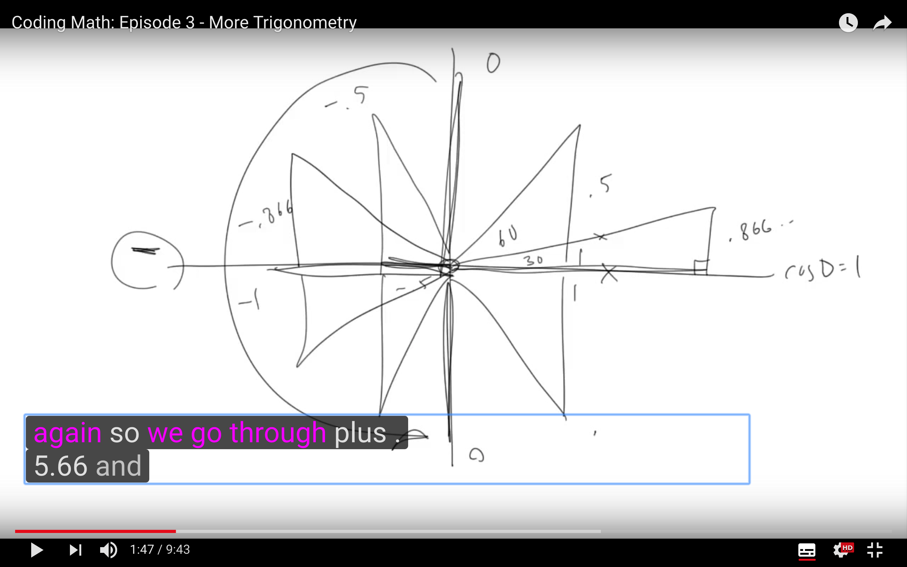
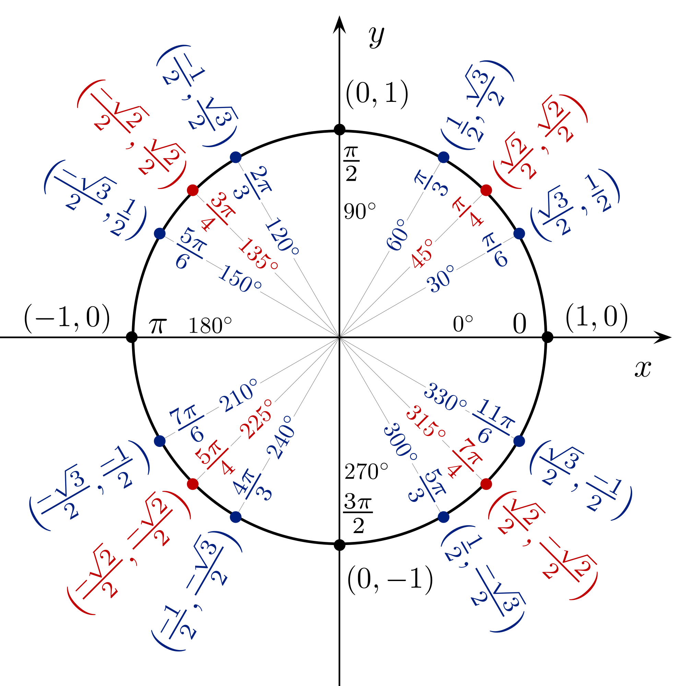
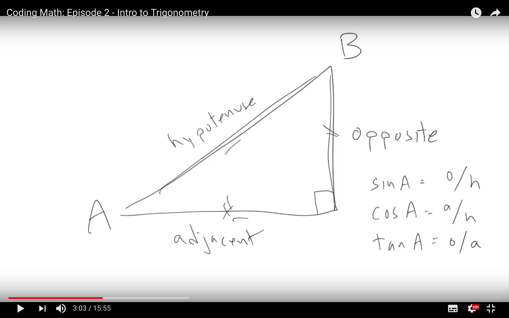

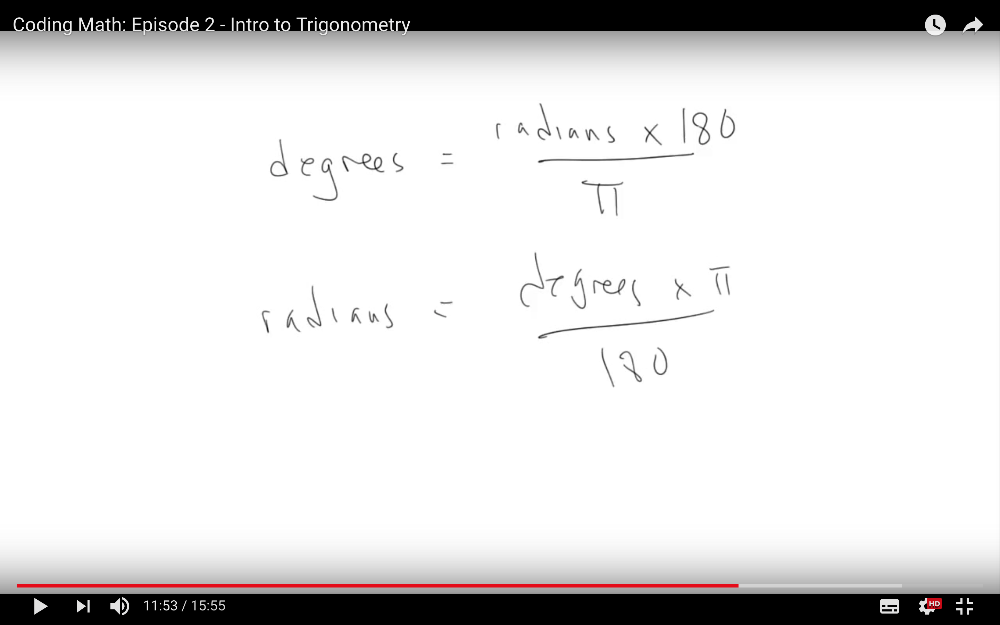
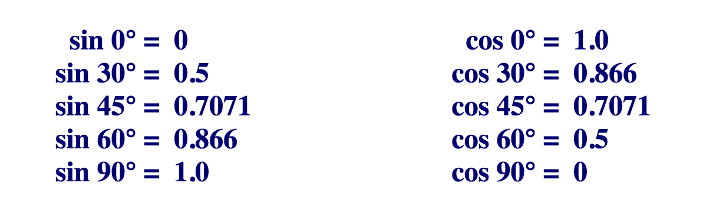
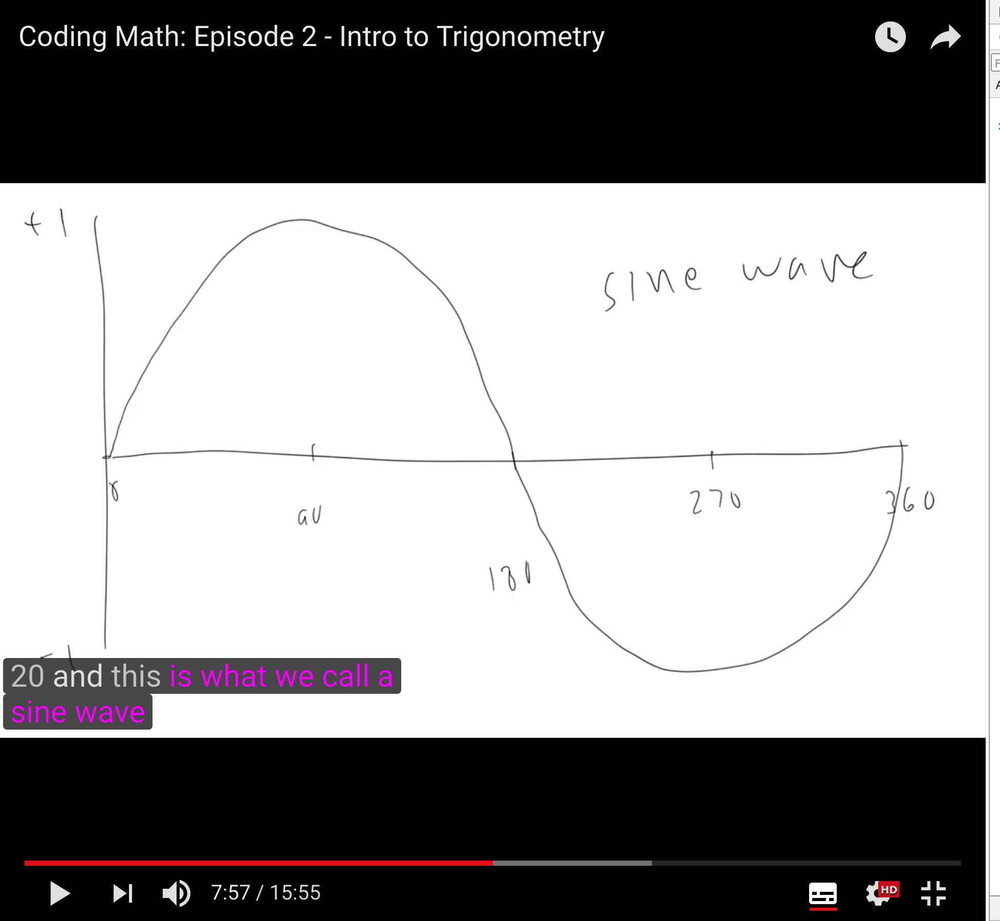
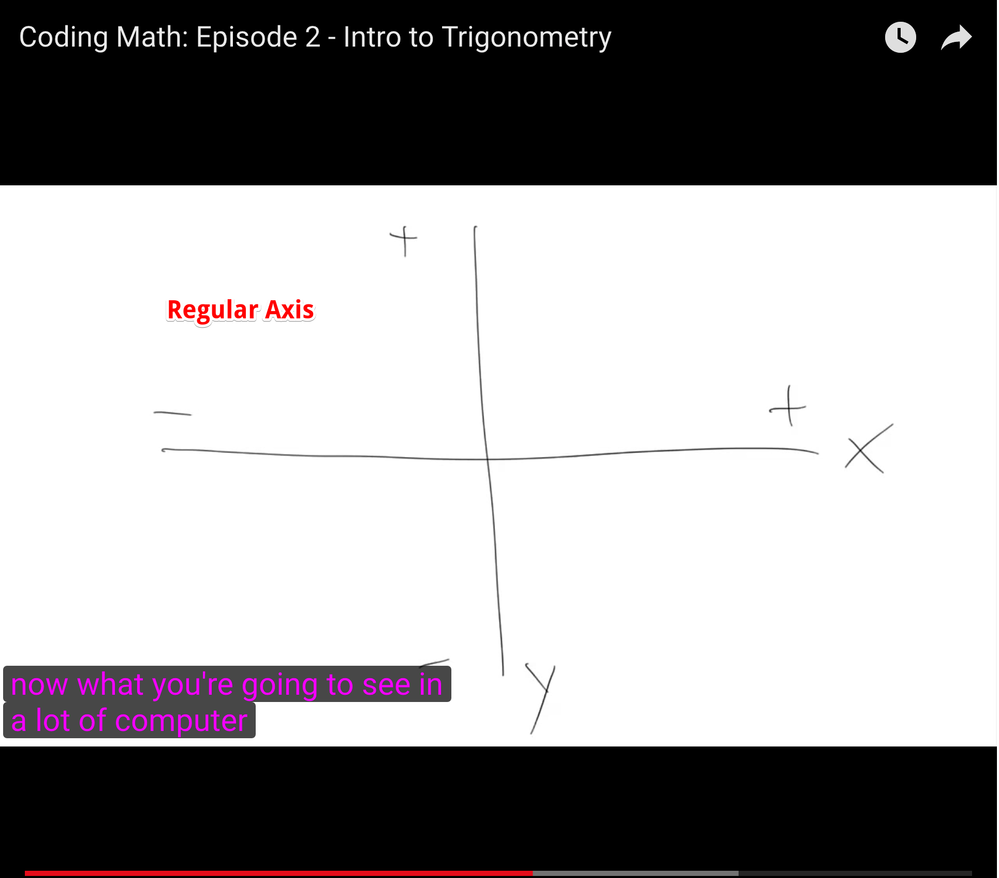
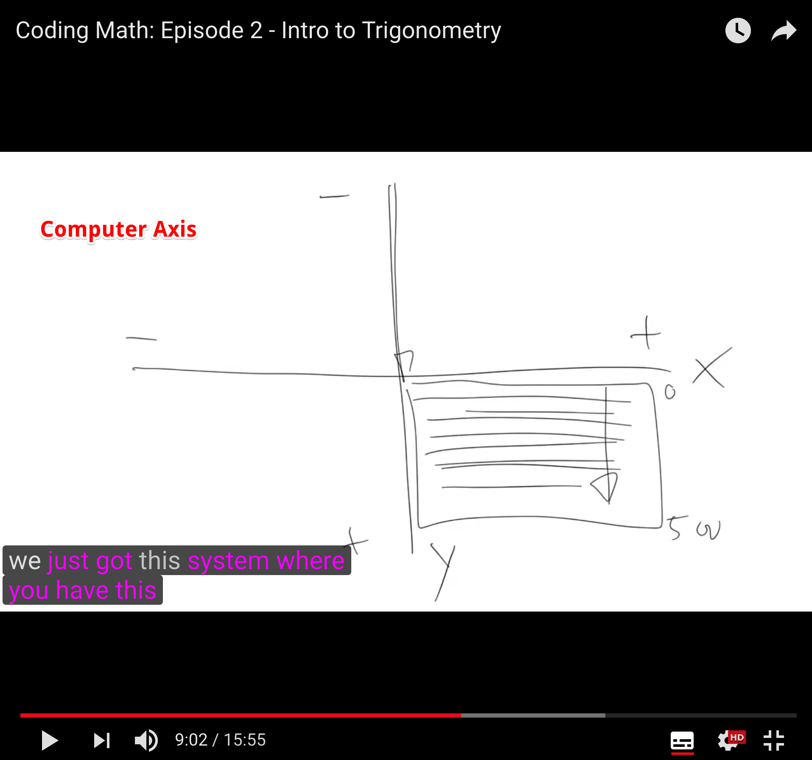
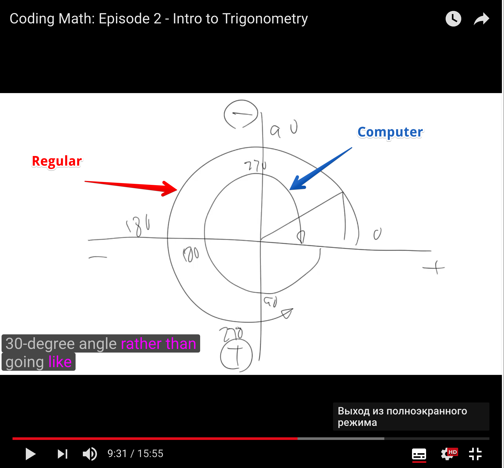
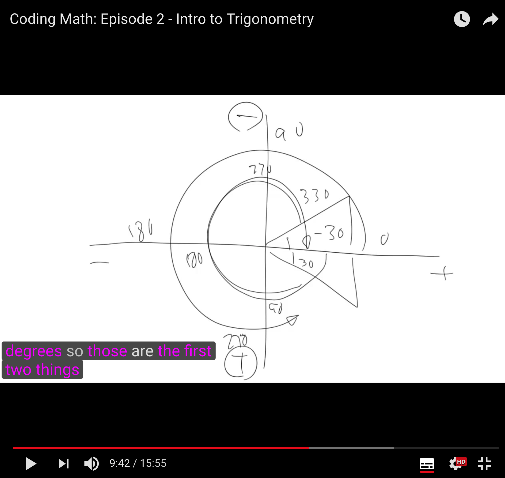
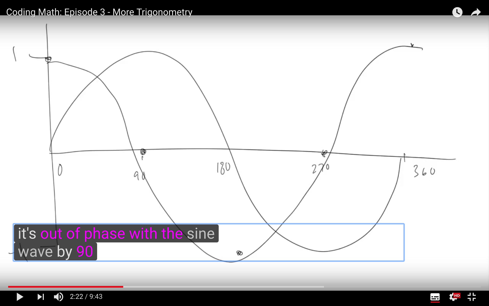
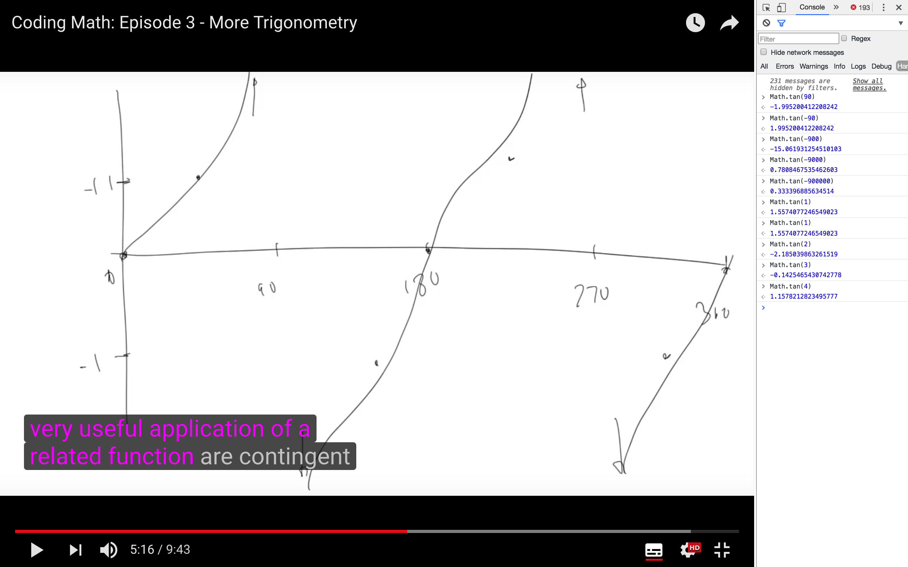